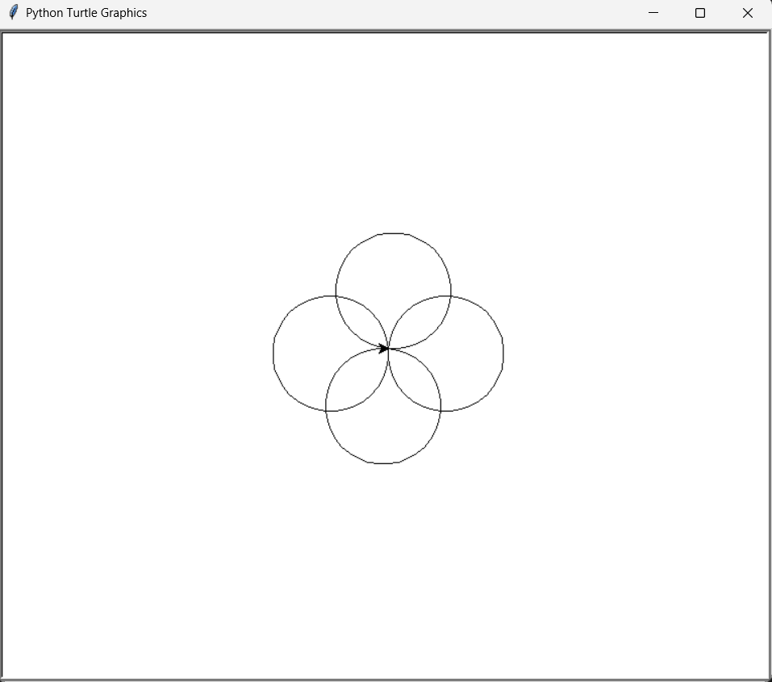

# 🖊️ Etch-a-Sketch Simulator

The **Etch-a-Sketch Simulator** is a Python-based interactive drawing application inspired by the iconic mechanical toy of the same name. This project brings nostalgic creativity into the digital age by allowing users to sketch freely on a canvas using keyboard-driven directional controls. Built with Python's native `turtle` graphics module, the simulator provides an engaging, educational experience while introducing core programming concepts such as event handling, real-time input processing, and GUI-based interaction.

It’s not just a toy; it’s a playful gateway into Python development — perfect for beginners exploring graphical interfaces or hobbyists reliving a bit of childhood joy through code.

---

## 🧩 Overview

This project was developed as a foundational Python exercise aimed at exploring the intersection of logic, design, and interactivity. The simulator emulates the behavior of a traditional Etch-a-Sketch by enabling real-time control of a digital pen using simple keyboard inputs. Users can draw lines, turn the pen at angles, move backward and forward, and even reset the canvas — all with intuitive key mappings.

Beyond its playful surface, this project teaches key principles of procedural and event-driven programming, offering a great way to understand how user input can directly affect visual output in a graphical environment. With minimal dependencies and clean code, it is easy to run, understand, and extend.

---

## ⚙️ Technologies & Concepts Used

| Category         | Description                                                                 |
|------------------|-----------------------------------------------------------------------------|
| **Language**     | Python 3.13 (or later recommended)                                          |
| **GUI Library**  | `turtle` module — for real-time graphical output and interactive visuals    |
| **Input Handling**| `Screen.onkey()` — to capture and map keyboard inputs to turtle actions     |
| **OOP Principles**| Utilizes the `Turtle` class to instantiate and control the drawing cursor   |
| **Event-Driven Architecture** | Responds to keyboard inputs to control drawing flow in real time  |
| **Cross-Platform Support** | Runs on any OS with Python and Tkinter support                    |

Additional environment configurations are used to ensure smooth execution on Windows systems by setting `TCL_LIBRARY` and `TK_LIBRARY` paths for `tkinter` dependencies.

---

## 🎮 Gameplay Mechanics

| Control Key | Functionality                               |
|-------------|----------------------------------------------|
| `W`         | Moves the turtle forward                     |
| `S`         | Moves the turtle backward                    |
| `A`         | Rotates the turtle 10° to the left (counter-clockwise) |
| `D`         | Rotates the turtle 10° to the right (clockwise)        |
| `C`         | Clears the canvas and resets the turtle to center       |

The simulator responds instantly to key presses, allowing users to draw seamlessly on the canvas. Each movement of the turtle leaves a visible trail, mimicking the behavior of a real Etch-a-Sketch. The controls are simple yet powerful, enabling the creation of freehand sketches, geometric patterns, or just experimental doodles. Pressing `C` clears the canvas and repositions the turtle at the origin, allowing users to start fresh without restarting the program.

---

## 📁 Project Structure

```
etch-a-sketch-simulator/
    ├── main.py     # Core application logic
    ├── README.md   # Project documentation
```

---

### 🚀 How to Run

> ⚠️ Ensure you have **Python 3.10+** installed.

### Prerequisites
- Python 3.10 or above
- Compatible terminal or IDE (e.g., VS Code, PyCharm)

1. Install the required dependencies (if not already present):
   ```bash
   pip install turtle
   ```

2. **Clone the repository**
   ```bash
   git clone https://github.com/your-username/etch-a-sketch-simulator.git
   ```

3. **Navigate to the project folder**
   ```bash
   cd etch-a-sketch-simulator
   ```

> 💡 **Optional – Windows Only:** If you encounter errors related to `TCL_LIBRARY` or `TK_LIBRARY`, ensure that your Python installation's Tcl paths are correctly set using `os.environ` at the beginning of your script:
   ```bash
   import os
   os.environ['TCL_LIBRARY'] = r'C:\Program Files\Python313\tcl\tcl8.6'
   os.environ['TK_LIBRARY'] = r'C:\Program Files\Python313\tcl\tk8.6'
   ```

4. **Run the script**
   ```bash
   python main.py
   ```

---

## 🖼️ Sample Output

Below is a glimpse of the Etch-a-Sketch Simulator in action. The screenshot showcases the interactive drawing interface powered by Python's `turtle` graphics module.

<p align="center">
  
</p>

> 🎨 Use the W, A, S, D keys to draw in real-time — just like the classic toy, but better!

---

## 🔑 Key Highlights

- 🎯 **Interactive Drawing Experience**  
  Brings the nostalgic Etch-a-Sketch toy to life with real-time keyboard controls for an engaging and intuitive drawing experience.

- 🚀 **Keyboard-Based Navigation**  
  Designed with custom key bindings (W, A, S, D) for fluid movement in all directions, allowing for precise control and smooth line rendering.

- ♻️ **Dynamic Canvas Reset**  
  Instantly clear the drawing and reposition the turtle to its origin using the `C` key — enabling quick restarts without restarting the program.

- 🧠 **Logic-Driven Design**  
  Implements structured logic for movement and rotation using heading manipulation instead of fixed angles, promoting flexibility in directional control.

- 🛠️ **Lightweight & Minimalistic**  
  Built with Python’s built-in `turtle` and `tkinter` libraries — no third-party dependencies required, ensuring simplicity and compatibility.

- 📚 **Educational Value**  
  Developed as part of a professional Python bootcamp to reinforce concepts like function binding, event-driven programming, and procedural drawing.

---

## 📝 Credits

- 👨‍💻 **Project Author**: Siddha Kadam  
  BCA Student | Aspiring AI/ML Engineer | System-Level Developer

- 🧑‍🏫 **Inspired By**:  
  This project was developed while learning foundational Python concepts under the guidance of **Dr. Angela Yu** in a structured coding curriculum focused on real-world applications.

- 📦 **Core Technologies Used**:  
  Python 3.11+, Turtle Graphics, Tkinter

- 📌 **Special Acknowledgment**:  
  To the global open-source community and educational resources that empower beginners to transform foundational logic into creative applications.

> ✨ This project is a stepping stone toward mastering interactive Python development and graphical programming. Proudly crafted with focus, intent, and a passion for learning.

---